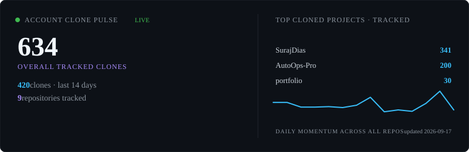

  
   
  

## About

I'm **Suraj Dias**, a Computer Science & Business Systems student at St. Joseph Engineering College (graduating in 2027). I build backend systems and AI-enabled products, with a particular interest in compilers, observability, and making complex systems easier to understand.

My engineering principle is simple: build the smallest system that is clear, dependable, and easy for the next person to operate. Good software should be understandable under pressure—not only impressive in a demo.

## Current focus

### Now building

AI-assisted observability workflows in AutoOps Pro, with attention to anomaly-detection accuracy and practical failure signals.

### Current learning

Distributed-systems fundamentals, fault tolerance, cloud-native backend design, and data structures and algorithms.

### Open source

Looking for focused opportunities to contribute to tools I use and learn from.

## Technology stack

| Area | Technologies |
|------|--------------|
| 💻 Languages | Java, Python, TypeScript, JavaScript, C |
| 🎨 Frontend | React, HTML5, CSS3, Tailwind CSS |
| ⚙️ Backend | Node.js, Express.js, FastAPI, Flask |
| 🗄️ Databases | MongoDB, MySQL, PostgreSQL |
| 🚀 DevOps & Deployment | Docker, Git, GitHub, Linux, Bash, Vercel |
| 🤖 AI / ML | Python, Machine Learning, Applied ML Workflows |
| 🛠️ Tools | VS Code, Postman |

### 💻 Languages

  

### 🎨 Frontend

  

### ⚙️ Backend

  

### 🗄️ Databases

  

### 🚀 DevOps & Deployment

  

## Recent & featured projects

### [AutoOps Pro](https://github.com/SurajDias/AutoOps-Pro)

AI-assisted observability platform for anomaly detection, root-cause analysis, and predictive failure signals across live system metrics.

`Python` `FastAPI` `React` `Machine Learning`

### [Career Guardian AI](https://github.com/SurajDias/Career-Guardian-AI)

Career assistant that analyzes résumés, identifies skill gaps, and produces personalised learning roadmaps from a candidate profile.

`Python` `FastAPI` `React`

### [MiniCompiler Studio](https://github.com/SurajDias/MiniCompiler-Studio)

A compiler front end built from first principles: lexing, recursive-descent parsing, AST generation, and a regex engine using ε-NFA to DFA conversion.

`Java` `Parsing` `Automata Theory`

### [Customer Churn Dashboard](https://github.com/SurajDias/Customer-Churn-Intelligence-Dashboard)

Machine-learning dashboard that identifies at-risk customers and surfaces the signals behind each prediction for practical decision-making.

`Python` `Machine Learning`

## GitHub statistics

  
  
   
  

## Contribution activity

  

## Portfolio clone report

  

Tracks clones across all public repositories, past and future · updates daily via GitHub Actions

## Connect

   <a href="https://www.surajdias.tech">Portfolio</a>
  &nbsp;·&nbsp;
  <a href="https://www.linkedin.com/in/thesurajdias">LinkedIn</a>
  &nbsp;·&nbsp;
  <a href="mailto:diassuraj13@gmail.com">Email</a>
  &nbsp;·&nbsp;
  <a href="https://github.com/SurajDias">GitHub</a>

